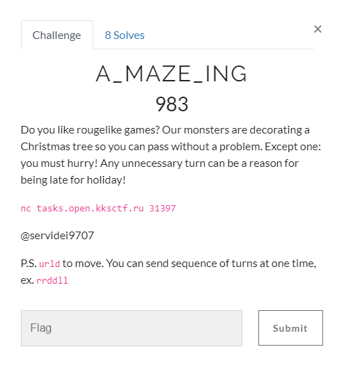
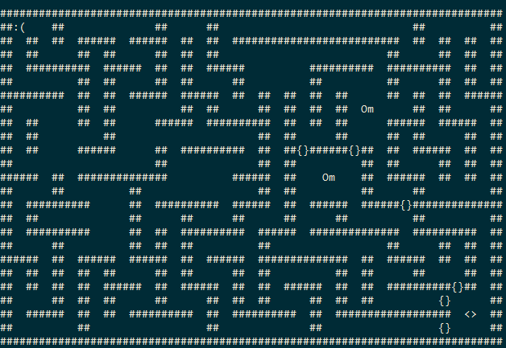

# A_MAZE_ING (PPC) \[983\]



## __Solution__



Regular maze with doors "**{}**" and keys "**Om**". Target is "**<>**"

The problem is that we need the shortest path. Easy task for [BFS](https://en.wikipedia.org/wiki/Breadth-first_search)

The key idea here is find all possible routes through checkpoints (i.e. doors, keys, and the exit),
calculate their paths using BFS and choose the shortest.
That will guarantee that we will always get the shortest possible path 
even on more complex mazes than we're given

1. Recursively search for all available checkpoints excluding those we already visited 
and keeping track of the keys collected

2. Calculate the path for each route by concatenating paths produced by BFS 
between 2 consecutive checkpoints. Every door except the door at the destination is ignored. 
Remove first element from each path except the path between the first 
and the second checkpoint because BFS returns both the starting and the final point.

3. Choose the shortest path

See source: [maze.py](maze.py).

[`Vector`](vector.py) is a simple 2d array-like vector which performs math operations
on x and y coordinates independently


Solve the maze many times and get the flag:

```
kks{A*_41g0ri7hm_|s_600D_3n0U6h!}
```